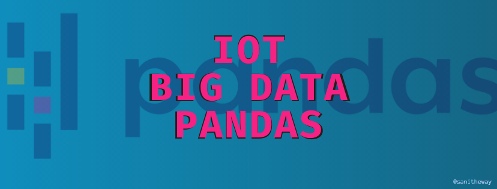

<div align='center'>
  <br>
</div>

# [Pandas_IoT_BigData](Sanidhya_IoT_A1.ipynb)

---

**PANDAS**: The one of the most useful library in Pyhton. 

Pandas is used for data manipulation and data analysis. Python with Pandas is used in a wide range of fields including academic and commercial domains including finance, economics, Statistics, analytics, etc.

Here I started learning this pyhton's pandas library as it is in my course of **Big Data in IoT**. As my learning proceed, I will get familier with libraries like:
* **Pandas**
* **Numpy**
* **Matplotlib**
* **And many other related topics** 😎

#### ***SOME OF THE USEFUL LINKS:***
```
Description: 
The purpose of sharing these links are for providing the resources at one place to help readers. 
```
* [Numpy - w3schools](https://www.w3schools.com/python/numpy_creating_arrays.asp)
* [10min to pandas - pandas.pydata.org](https://pandas.pydata.org/pandas-docs/stable/user_guide/10min.html)
* [Pandas Tutorials - data36.com](https://data36.com/pandas-tutorial-1-basics-reading-data-files-dataframes-data-selection/)
* [Data visualizatin - Matplotlib/pyplot- matplotlib.org](https://matplotlib.org/tutorials/introductory/pyplot.html)
* [Matplotlib - edureka.co](https://www.edureka.co/blog/python-matplotlib-tutorial/?ranMID=42536&ranEAID=a1LgFw09t88&ranSiteID=a1LgFw09t88-ePKHCONGTR9bJ0np9Z_nUw&LSNSUBSITE=Omitted_a1LgFw09t88)
* [Pandas Excercises - w3resource.com](https://www.w3resource.com/python-exercises/pandas/index.php)
* [Pandas Learning - kaggle.com](https://www.kaggle.com/bhasha4995dushara/pandas-exercise-1)
* [Datasets- stats.govt.nz](https://www.stats.govt.nz/large-datasets/csv-files-for-download/)
* [Dataset Forest Fire **(here used)** - kaggle.com](https://www.kaggle.com/gustavomodelli/forest-fires-in-brazil)
* [Pandas Excercise Learning- pynative.com](https://pynative.com/python-pandas-exercise/)
* [Learning Pandas - GfG](https://www.geeksforgeeks.org/pandas-practice-excercises-questions-and-solutions/)
* [101Pandas - machinelearnigplus.com](https://www.machinelearningplus.com/python/101-pandas-exercises-python/)
* [Introduction to Seaborn- seaborn.pydata.org](https://seaborn.pydata.org/introduction.html)
* [Seaborn ploting Graphs- GfG](https://www.geeksforgeeks.org/plotting-graph-using-seaborn-python/)
```
 Any kind of change or any advice or any kind of help will always be welcomed. 😃
```
👀 [***CODE***](https://github.com/SaniTheWay/Pandas_IoT_BigData/blob/main/Sanidhya_IoT_A1.ipynb)

Download .ipynb file [📥](Sanidhya_IoT_A1.ipynb) 

##### ***Thanks!***
<div align='center'>

  ```
    Author:
 Sanidhya Dave
 sanithe_way©
       2021                           
 ```
</div>
